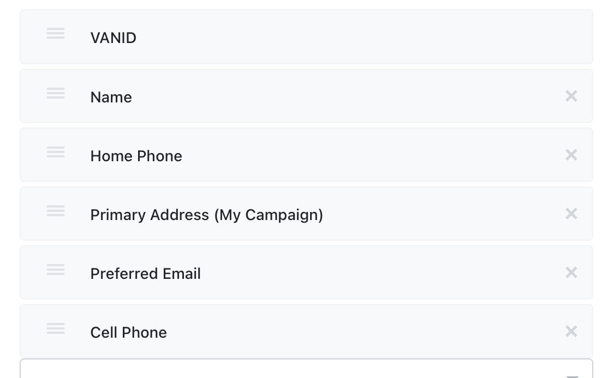

# Mobilize RSVPer
Automatically RSVP a TSV of contacts (i.e. from EveryAction) to a Mobilize America event. Utilizes a PostgreSQL database to store a queue of lists of contacts to RSVP.

## Heroku Setup
This is setup to be hosted on Heroku. Below are requirements when creating an app on Heroku.

### Buildpacks
1. heroku/python
2. https://github.com/heroku/heroku-buildpack-google-chrome
3. https://github.com/heroku/heroku-buildpack-chromedriver

### Config/Environment Variables
| Variable                 | Default/Recommended Value           | Purpose                                                                                                          |
| ------------------------ | ----------------------------------- | ---------------------------------------------------------------------------------------------------------------- |
| CHROMEDRIVER_PATH        | /app/.chromedriver/bin/chromedriver |                                                                                                                  |
| DEFAULT_CUSTOM_FIELD_VAL | PYTHON AUTO REGISTER                | Sets a default value for required custom fields on the RSVP page                                                 |
| FTP_HOST                 |                                     | Used to get/store contact lists                                                                                  |
| FTP_PASS                 |                                     | Used to get/store contact lists                                                                                  |
| FTP_USER                 |                                     | Used to get/store contact lists                                                                                  |
| GOOGLE_CHROME_BIN        | /app/.apt/usr/bin/google_chrome     |                                                                                                                  |
| GOOGLE_CHROME_CHANNEL    | stable                              | Google Chrome release channel                                                                                    |
| MIN_INTERVAL             | 3                                   | Time (in minutes) between events in queue                                                                        |
| SENTRY_DSN               |                                     | Sentry DSN URL                                                                                                  |
| SLEEP_TIME               | 0.5                                 | Time to wait between contact registrations. Recommended to be >0 so that the browser has time to submit the form |
| UTM_CAMPAIGN             | python+auto+register                | URL-escaped UTM campaign                                                                                         |
| UTM_MEDIUM               |                                     | URL-escaped UTM medium                                                                                           |
| UTM_SOURCE               |                                     | URL-escaped UTM source                                                                                           |

### Heroku Resources/Addons
1. Heroku Postgres - any plan is fine, including the free plan. The database only stores the queue; auto-registration requests are automatically deleted once completed.

## How to use
1. Head to / (the app's homepage)
2. Paste the Mobilize America RSVP URL (this is the public-facing link that people register for your events on)
3. Get a list of contacts in tab-separated-value format. If you're using EveryAction, export a list of contacts you want to register. The bot is pre-programmed to work super easily with the fields (in order) in the screenshot below (it's recommended that you copy this export format just so that it’s super easy to use, and save it for the future!). Export the list as a text file. Then Download the file EveryAction generates, unzip it, and upload the .txt file on the bot page.

5. If you exported from EveryAction with different columns/order, or got the list from something else, edit the column number fields (this is zero-indexed, so the first column is 0 not 1)
6. Submit! Depending on how many registrations are in the queue, this might be delayed. One submissions is done every 3 minutes (or whatever you set for `MIN_INTERVAL`), and it’ll give you an estimated time until your submission is completed based on how many are in the queue!
